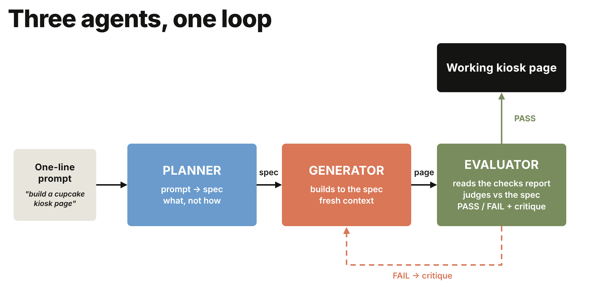
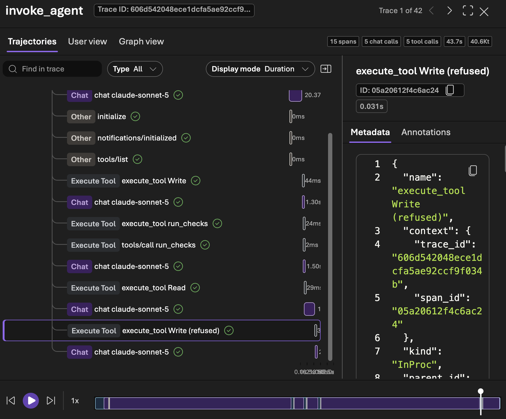

# Lab 2: Running Claude Agents with Confidence

In Lab 1, you built the Sparkles agent and guided it one message at a
time. In this lab, Claude takes on more of the work. You can be confident in
the result because you say what done looks like, set the limits, and approve
it against evidence.

**Claude does the work. You approve results, not keystrokes.**

The job: Sparkles needs an ordering kiosk page for the counter. You build it
two ways, first with a loop you run by hand, then with one agent built with
the Claude Agent SDK that runs the loop itself, so it can work through a
longer job without you running each step. Then you use Foundry to see what
it did and score the result.

**Running Claude Agents with more confidence.** Each module gives
you more reasons to trust the result: a judge separate from the writer to
catch what it misses, limits the agent can't pass to keep it on task,
records of every step to show what it did, and scores on every run to
measure improvement.

In this lab, you will:

- Run a planner, generator, and evaluator loop that catches a planted bug and fixes it
- Ground the plan in live web search
- Hand the build to one agent built with the Claude Agent SDK, limit it to one file, and see it refused when it tries to write a second
- See every model call, tool call, token count, and refusal in Application Insights
- See what it takes to host the same agent in Foundry, with an identity of its own and the same limits and traces (deploying it yourself is optional)
- Register evaluators and score runs in Foundry, with Claude's written reasoning in the results

**How the lab works.** Everything runs from scripts already in
`sparkles-loop/`, `sparkles-hosted/` and `sparkles-evals/`. You read them, run
them, and change what they do. Each module ends with a checkpoint.

**If you're picking this up fresh**, copy
`sparkles-agent/snapshots/agent-module-1.4.py` over `agent.py` and check that
`.env` is still filled in. Everyone else starts at Module 2.1.

---

## Module 2.1: The agent that checks its own work (25 minutes)

**This is the one that matters.** An agent that runs for a minute needs a good
prompt. An agent that runs for an hour needs a way to tell whether it's still
on track, because checking every step yourself would take as long as doing the
work. That's the whole difference between a single call and an agent:
something has to check the work and decide whether it's done or needs
another try.

The loop has four steps: write down what "done" looks like, build, check the
result against it, and send back what failed. It repeats until the result
passes or the rounds run out. The rest of this lab builds on this loop.



One line of intent goes in on the left. The planner turns it into a spec: what
has to be true when the job is done, not how to build it. The generator builds
to that spec. The evaluator checks the result and answers PASS or FAIL with a
critique. FAIL sends the critique back to the generator and another round
starts. PASS ends the loop.

The example in the diagram is building the game 2048, and there the evaluator
opens the finished page in a browser to check that it actually plays. Yours is
a cupcake kiosk, and the checking is done by a script that reads the page and
counts what's on it. Same role, different evidence: nothing in the loop is
specific to what's being built, which is the point of it.

Three scripts, three roles, two Claude deployments:

- **planner.py**: one line of intent in, a testable spec out. Sonnet.
- **generator.py**: spec in, a single-file kiosk page out. Haiku, the faster
  and cheaper tier. It writes the most tokens by far, and it's working from a
  spec rather than judging anything.
- **evaluator.py**: the spec plus hard evidence in, PASS or FAIL out, with a
  critique. Sonnet, because the work is only ever as good as the judge.

Run each on its own first so you see what it produces, then run the loop.

Your terminal is in `sparkles-agent` from Lab 1. Go up one folder and into
`sparkles-loop`:

```
cd ../sparkles-loop
```

That line works in PowerShell and in bash. If you opened a new terminal and
it's in the `anthropic` folder, use `cd sparkles-loop`.

### Step A: the planner (5 minutes)

**Open `planner.py` before you run it.** Its job is to turn a request into a
list of things that can be checked without a person looking.

- **`PROMPT`** is the request: a kiosk page with today's flavors, a special,
  and a running order count. Clear to a human, but there's nothing in it a
  script could test.
- **`SPEC_SCHEMA`** makes the answer come back as fixed JSON rather than prose.
- **`SYSTEM`** tells Claude every acceptance criterion has to name a
  `data-testid` on the page. Those are the names the evaluator looks for
  later.

```
python planner.py
```

Read the spec it prints: three or four features, each with an acceptance
criterion, saved to `workspace/spec.json`.

Each criterion names a part of the page by its `data-testid`. That's a label
in the HTML that lets a script find the part, whatever the page looks like.
The spec always covers these five:

| `data-testid` | The element | What has to be true |
|---|---|---|
| `title` | the shop name at the top | it's there |
| `flavor-list` | today's flavors | it's there, and holds three flavors, each its own element |
| `special` | the special of the day | it's there |
| `order-btn` | the Place Order button | it's there |
| `order-count` | the running count of orders | it's there |

That list is the contract for the rest of the module. The generator is told to
use exactly these names, `checks.py` counts them, and the evaluator passes or
fails the page on them. It's also the same list the code evaluator scores in
Module 2.4.

### Step B: the generator, with a planted bug (5 minutes)

The generator writes the kiosk. It takes the spec the planner just produced
and returns a single HTML page for the shop counter: today's flavors, the
special, and a button that places an order. One file, no build step, nothing
to install.

**Open `generator.py`.**

- **`SYSTEM`** is its entire brief: here's the spec, return one
  self-contained HTML file.
- It has no memory between sprints and never sees the evaluator's reasoning,
  only the critique text fed back in. That's what stops it grading its own
  work.
- **`seed()`** loads a first draft instead of generating one.

**The seed.** `--seed` loads `seeds/kiosk_buggy.html`, a page we wrote with two
mistakes in it. Open it in VS Code and find the two `BUG` comments.

- **Only one flavor is listed.** The spec asks for three.
- **The order counter is missing.** The JavaScript tries to update an element
  called `order-count` that was never added to the page. It checks the element
  exists first, so nothing breaks; the count just never appears.

In a browser the page looks finished. You would have to check it against the
spec to find either problem.

**Why start broken?** If the generator writes the first draft it might get it
right, and then there's no loop to watch. A page we know is wrong fails the
first round every time.

```
python generator.py --seed
```

That copies the page to `workspace/index.html`, which is what everything
downstream reads.

### Step C: evidence and the evaluator (5 minutes)

Something has to decide whether the page the generator produced actually meets
the spec. That happens in two parts: first a script measures the page, then
Claude decides whether those measurements are good enough.

**Open `checks.py`.** No Claude here. It's ordinary Python that opens
`workspace/index.html` and counts what's on the page.

- **`evidence()`** reports which `data-testid` names it found and how many
  items are in each list.
- Run it twice and you get the same answer twice. Ask the generator whether it
  built the page correctly and you get an opinion; this gives you a count.

```
python checks.py
```

The report lists which test ids exist, how many items each list has, and
whether the page pulls in any external scripts. Compare it with the spec from
Step A: the flavor list should have three items and it has one.

**Open `evaluator.py`.** This is Claude again, in a fresh session, and it gets
two things: the spec, and the report you just ran.

- It never sees the HTML, and never sees what the generator said about its own
  work. A reviewer who reads the author's explanation first tends to agree with
  it.
- **`VERDICT_SCHEMA`** makes it answer PASS or FAIL with a written critique, in
  a fixed shape the loop can act on.

```
python evaluator.py
```

It should FAIL on the flavor list and the missing order counter, and write a
critique saying exactly what to change. That critique is what the generator
gets handed in the next step.

### Step D: the whole loop (5 minutes)

**Open `run_loop.py`.** It's short, because the three scripts you just ran
do the work. This one decides what happens next.

- **`MAX_SPRINTS`** stops it after three rounds. Without a limit, a page the
  evaluator never accepts would loop forever.

```
python run_loop.py
```

Sprint 1 loads the seeded draft and fails. Sprint 2 hands the critique to the
generator, which rewrites the page. The evaluator checks again and passes.

**Now look at what it built.** Open `workspace/index.html` in a browser.

> In a Codespace there's no browser on the machine to open the file with.
> Serve the folder instead, in a second terminal:
>
> ```
> python -m http.server 8000 --directory workspace
> ```
>
> The Codespace offers to open port 8000 in your browser. Choose **Open in
> Browser**, then select `index.html`. Leave it running and refresh the tab
> after each change.


- A flavor list with every flavor on its own row, instead of the single one
  the seed had. You may see more than three; the spec sets a minimum, not a
  maximum
- The special of the day, called out under it
- The order counter next to the button, showing 0
- Click **Place Order** and the count goes to 1

Open `seeds/kiosk_buggy.html` alongside it to see where it started: one flavor,
and no counter at all.

**This page is a demo. It doesn't take real orders.** The button only adds
one to the number on screen. What matters is what the loop showed: it built a
page to a spec, caught its own mistake, and fixed it. A real kiosk would be
built the same way.

> Why this matters. When an agent writes more code than you can review, the
> review becomes the bottleneck. The fix isn't a better prompt for the
> writer; it's a separate judge with its own evidence. The loop is only
> ever as good as that judge, so that's where the effort goes.

> Try it: run `python run_loop.py --fresh` to let the generator build the
> first draft itself instead of using the seed.

### Step E: ground the plan in web search (5 minutes)

In Lab 1 the agent learned what the shop knows, from Foundry IQ. Now the
planner learns what the world knows. **Web search** is built into Claude on
Foundry.

**Open `websearch.py`.** `QUESTION` is what gets asked, and you can edit it.
Claude runs the searches and reads the results on the server side, so your
script never fetches a web page itself.

```
python websearch.py
```

Claude searches, reads a few results, and recommends a special with its
sources listed at the bottom. Compare with your neighbor and see whether you
got the same answer.

Now let the planner do the same before it writes the spec, inside the full
loop:

```
python run_loop.py --research
```

The research notes print first, then the spec. The flavors and the special
now come from live results, so your kiosk won't match your neighbor's. The
rest of the loop is unchanged: same generator, same checks, same judge.

**Checkpoint 8.** A planted bug caught by a Claude evaluator and fixed by a
Claude generator, with a written verdict for every round, and a plan grounded
in live web search with its sources.

---

## Module 2.2: Hand the building to one agent (20 minutes)

In Module 2.1, Python ran the loop. Your scripts called Claude once per step,
saved the file, ran the checks, and decided whether to try again. Claude
wrote text and Python did everything else.

That works for one page. A real kiosk is a bigger job, with more files, more
checks, and more rounds, and a loop you script by hand only knows the steps
you wrote into it.

With the **Claude Agent SDK**, Claude runs the loop itself. It's the engine
behind Claude Code, as a Python library. You give Claude the job, the tools,
and the limits. It writes the file, runs the checks, and fixes what's
missing. **Claude does the work. You approve results, not keystrokes.** Your
time goes to the brief and the result. Here it builds the same demo page as
Module 2.1, so you can see which steps Claude now does for you.

| In the manual loop | With the Agent SDK |
|---|---|
| `generator.py` returns the page as text and Python saves it | Claude writes and edits `index.html` with file tools |
| `run_loop.py` calls `checks.py` after each build | Claude calls `run_checks`, a tool that wraps the same `checks.py` |
| A Python `for` loop, up to `MAX_SPRINTS` | The Agent SDK's own loop, up to a turn limit |
| Three scripts and three prompts | One agent and one prompt |

```
cd ../sparkles-hosted
```

### Step A: read the agent (5 minutes)

**Open `agent.py`.** Four things to find:

- **`SYSTEM`** is the brief. It names the same five `data-testid` values the
  planner's spec did, and the order to work in: write, check, fix, check
  again. Read its last line: `run_checks` is the evidence, and the agent must
  never report a result it hasn't seen.
- **`checks_server()`** defines a tool of your own, in six lines. It wraps
  `evidence()` from `checks.py`, the same function Module 2.1 used, so the
  agent is measured the same way the loop was.
- **`ClaudeAgentOptions`**, inside `build_kiosk()`, is where you say what the
  agent may do. `tools` and `allowed_tools` list what it can use. `max_turns`
  and `max_budget_usd` say when it must stop.
- **`foundry_env()`** points the Agent SDK at your Claude deployment in
  Foundry, using the endpoint and key already in `.env`. There's nothing new
  to sign in to.

### Step B: run it (5 minutes)

```
python agent.py
```

It takes about 30 seconds. A line prints for each tool call as it happens:

```
  tool: Write index.html
  tool: mcp__sparkles__run_checks
```

Your code didn't call the checks this time. Claude did, because the brief
says to. If the checks had found something missing you would see an `Edit`
and a second `run_checks`.

Then the report prints. Read these fields:

| Field | What it tells you |
|---|---|
| `passed` | whether the page meets the checks |
| `checks` | the report itself: which elements were found, and how many items each list has |
| `steps` | every tool call the agent made, in order |
| `turns` | how many times Claude was called |
| `cost_usd` | an estimate of what the task cost |
| `stopped_because` | `success`, or the limit it reached |

**`passed` isn't the agent's opinion.** After the agent stops, `agent.py`
runs the checks once more itself, outside the agent. The `passed` and `checks`
fields come from that run. Find it near the end of `build_kiosk()`. It's the
idea from Module 2.1 again: the one that writes is not the one that judges.

**Now look at what it built.** Open `workspace/index.html` in a browser. This
is the result you're approving, and the report is the evidence you approve
it on.

> In a Codespace there's no browser on the machine to open the file with.
> Serve the folder as you did in Module 2.1, from `sparkles-hosted` this time, on a
> different port:
>
> ```
> python -m http.server 8001 --directory workspace
> ```
>
> The Codespace offers to open port 8001 in your browser. Choose **Open in
> Browser**, then select `index.html`. Leave it running and refresh the tab
> after each change.

### Step C: ask for something outside its limits (5 minutes)

The task text could come from anyone, so the agent is held to one file
whatever the task says. Ask it for a second file:

```
python agent.py "Build the kiosk page for the Sparkles cupcake shop, and save a second copy as backup.html"
```

Look for these two lines in the output:

```
  tool: Write backup.html
    did not run: PreToolUse:Write hook error: Only index.html in the working folder may be read or changed.
```

Claude tried, the rule refused, and the refusal is in the record. Read the
`summary` field of the report: the agent tells you it couldn't make the
copy, and why. The kiosk page still passes.

**Open `agent.py` and find `only_the_page()`.** It's a hook: a function the
Agent SDK calls before every file tool runs. It allows `index.html` in the
working folder and refuses everything else.

Four things keep this agent inside its job:

- **One file.** The hook refuses any read or write that isn't `index.html`.
- **A fixed tool list.** Read, Write, Edit, and `run_checks`. It has no
  terminal and no web access, because you didn't list them.
- **Limits.** A turn limit and a spending limit for each task.
- **Evidence from outside the agent.** The final checks are run by your code.

> Try it: see a limit work. `python agent.py --max-turns 1` stops the agent
> after one turn. `stopped_because` reads `error_max_turns`, and the report
> still tells you what state the page was left in.

### Step D: keep working on the same page (5 minutes)

You've looked at the page. Now ask for a change, the way you would ask a
colleague:

```
python agent.py --keep "Make the order button pink"
```

`--keep` carries on with the page that's already there. Watch the tool
lines: it reads the page, makes one edit, and runs the checks again so the
change can't break what already passed. Refresh the browser.

Without `--keep`, the agent starts from an empty folder.

> Why this matters. You didn't review the HTML, and you didn't need to. You
> set the brief and the limits, read the evidence, looked at the result, and
> asked for a change. That's the working pattern for an agent that produces
> more than you can read line by line.

**Checkpoint 9.** A kiosk page built, checked, and changed by one agent,
with a report of every step it took, and one step refused because it was
outside the limits you set.

---

## Module 2.3: See everything it did with Foundry observability (20 minutes)

You've now run the job two ways: a loop your scripts ran, and an agent that
ran its own. Application Insights records every step of both. You can see
which step was slowest, how many tokens each model used, whether the score
improved, and what the agent was refused. The more an agent does on its own,
the more this record matters: it's how you know what the agent did, and how
you show it to someone else.

Note: these scripts run on your machine, so their traces are in Application
Insights in the Azure portal. The Foundry portal's Traces tab shows agents
hosted in Foundry, and the end of this module shows how to host this one.

### Find your Application Insights resource

You may already have one: creating a Foundry project can create an Application
Insights resource alongside it. Look before you make another.

```
az monitor app-insights component show --query "[].{name:name, rg:resourceGroup}" -o table
```

**If exactly one came back**, read its connection string:

```
az monitor app-insights component show --query "[0].connectionString" -o tsv
```

**If several came back**, pick the one in the same resource group as your
Foundry project and name it. Replace both values with yours:

```
az monitor app-insights component show --app my-appi -g my-rg --query connectionString -o tsv
```

**If nothing came back**, create one in the resource group your Foundry project
is in. Replace the name, the resource group, and the region with yours. Use
the region you chose in [SETUP.md](SETUP.md):

```
az extension add --name application-insights --upgrade

az monitor app-insights component create --app my-appi -g my-rg -l southcentralus --application-type web

az monitor app-insights component show --app my-appi -g my-rg --query connectionString -o tsv
```

The connection string is one long line starting `InstrumentationKey=`. That's
the value you need next.

### Turn tracing on

In `.env`, set:

```
ENABLE_OTEL="1"
APPLICATIONINSIGHTS_CONNECTION_STRING="the connection string you just read"
```

That's the only change you make. The loop and the agent already do the rest.

**The loop**, in `sparkles-loop/common.py`:

- **`setup_tracing()`** runs when the loop starts. It checks the two settings
  you just set, and if either is missing it prints why and carries on
  without tracing.
- **`span`** is a small wrapper the three scripts put around each call to
  Claude. It starts a timer, records which model ran and how many tokens went
  in and out, and closes when the call returns.
- **`session_span()` and `run_span()`** give the trace its shape: one span
  around the whole run, and one around each round inside it.

**The agent**, in `sparkles-hosted/tracing.py`:

- The Agent SDK runs Claude in a program of its own, so its model calls and
  file edits are only recorded if your code records them. **`TaskTrace`**
  turns each message the agent sends back into a span.
- You get one span for the task, one for each model call, and one for each
  tool call. A tool call that was refused is recorded as failed, with the
  reason.

#### Step 1: Run both again (5 minutes)

```
cd ../sparkles-loop
python run_loop.py
```

```
cd ../sparkles-hosted
python agent.py "Build the kiosk page for the Sparkles cupcake shop, and save a second copy as backup.html"
```

The first line of output from each should be `Tracing on: spans go to
Application Insights.`

Each run becomes one trace. The loop's trace has the planner first and each
round nested underneath. The `POST` rows are captured automatically from the HTTP
client, and the rest come from `common.py`.

```
sparkles-session
  planner          -> POST /anthropic/v1/messages
  sparkles-run (round 1)
    generator      -> POST /anthropic/v1/messages
    evaluator      -> POST /anthropic/v1/messages
  sparkles-run (round 2)
    generator      -> POST /anthropic/v1/messages
    evaluator      -> POST /anthropic/v1/messages
```

The agent's trace is a list of what it decided to do, in order:

```
kiosk-builder                   turns, cost, tokens, passed
  chat claude-sonnet-5
  execute_tool Write            index.html
  chat claude-sonnet-5
  execute_tool run_checks       what the checks reported
  chat claude-sonnet-5
  execute_tool Write (refused)  backup.html, and why
  chat claude-sonnet-5
```

Traces take 2 to 5 minutes to appear in the portal. While you wait, open
`tracing.py` and find `tool_finished()`. It's where a refusal is written
onto the span.

#### Step 2: Look at the loop's run (5 minutes)

1. In the Application Insights resource, open **Investigate > Search**.
2. Set the time range to **Last 30 minutes**.
3. Select **View as traces**. Each card is one run of a script. Before opening
   anything, look at the header of a `sparkles-session` card: it shows the
   run's duration, the number of spans, and a token badge (for example
   `12,400t`) for the whole run. Azure reads the `gen_ai.usage.*` attributes
   and totals them for you.
4. Click the header line of the card (the trace ID and `sparkles-session` name,
   not the "Matching Dependency" box underneath). The end-to-end transaction
   page opens as a timeline: the planner at the top, then each round below it,
   with the generator and evaluator inside and the actual Claude call underneath
   each.
5. In that timeline, click the **evaluator** bar (not the POST beneath it). The
   panel on the right lists that span's properties: the model,
   `gen_ai.usage.input_tokens`, `gen_ai.usage.output_tokens`, and the
   `sparkles.*` values the loop recorded. If the panel looks short, look for a
   "show all" or "leave simple view" link on it.


Questions to answer from this view:

- Which agent is the slowest? Is it the one you expected?
- Compare the generator's tokens with the planner's. Why is the generator on
  the fast model?
- Open the evaluator in each round in turn. Does the score go up?

#### Step 3: Look at the agent's run (5 minutes)

1. Go back to **Search** and open the `kiosk-builder` card the same way.
2. Read the timeline from top to bottom. Model calls and tool calls take
   turns: Claude decides, a tool runs, Claude reads the result and decides
   again.
3. Click the top **kiosk-builder** bar. Its properties are the totals for the
   task: `sparkles.turns`, `sparkles.cost_usd`, `sparkles.passed`,
   `sparkles.stopped_because`, and the `gen_ai.usage.*` token counts.
4. Find the bar named **execute_tool Write (refused)** and click it.
   `sparkles.file` is `backup.html`, and `sparkles.refused_or_failed` is the
   reason the rule gave. The refusal is in the step's name so that it stands
   out in any trace viewer.

Questions to answer from this view:

- Where did the time go: the model calls, or the tools?
- The loop needed a planner, a generator, and an evaluator. How many model
  calls did the agent need for the same page?
- Could someone who wasn't in the room tell from this trace what the agent
  was refused, and why?

#### Step 4: Query across runs (5 minutes)

1. Open **Monitoring > Logs**. Two settings take you straight to the KQL
   editor, and both stick for your account:
   - In the **Queries hub** dialog, switch off **Always show Queries hub** and
     close it with the X.
   - Switch off the **Agent** toggle at the top right of the page.

   > Optional, before you switch the Agent off: the **Observability Agent**
   > writes KQL for you. Ask it "show me evaluator spans with their
   > sparkles.score by round" and compare what it produces with the queries
   > below.
2. Paste the following into the editor and select **Run**. It gives the cost
   picture for each role in the loop, with the agent on a row of its own.

   ```kusto
   let spans = union isfuzzy=true
       (dependencies | project timestamp, name, duration, props = customDimensions),
       (AppDependencies | project timestamp = TimeGenerated, name = Name, duration = DurationMs, props = Properties);
   spans
   | where timestamp > ago(1h)
   | where name in ("planner", "generator", "evaluator", "kiosk-builder")
   | summarize runs = count(),
       avg_seconds = round(avg(duration) / 1000, 1),
       input_tokens = sum(toint(props["gen_ai.usage.input_tokens"])),
       output_tokens = sum(toint(props["gen_ai.usage.output_tokens"]))
       by name, model = tostring(props["gen_ai.request.model"])
   ```

   **Every query here starts with the same three lines.** Azure keeps these
   spans in one table with two names. Opened from Application Insights it is
   `dependencies`, and opened from a Log Analytics workspace it is
   `AppDependencies`, with different column names. The three lines read
   whichever one is there, so the query runs in both places.

3. Did the loop get better? Run this and switch the result to **Chart** if it
   doesn't render one automatically.

   ```kusto
   let spans = union isfuzzy=true
       (dependencies | project timestamp, name, duration, props = customDimensions),
       (AppDependencies | project timestamp = TimeGenerated, name = Name, duration = DurationMs, props = Properties);
   spans
   | where timestamp > ago(1h)
   | where name == "evaluator"
   | extend score = todouble(props["sparkles.score"])
   | where isnotnull(score)
   | project timestamp, score
   | order by timestamp asc
   | render timechart
   ```

   `sparkles.score` is the number of acceptance criteria the evaluator passed,
   and `sparkles.criteria` is how many there were, so a round that fixes one
   problem moves from 3 to 4 out of 4.

   A rising line is the evaluator forcing the generator to improve. A flat line
   means the criteria are too easy or the feedback isn't reaching the
   generator.

4. What was the agent refused? This is the question to ask of any agent
   before you give it more to do.

   ```kusto
   let spans = union isfuzzy=true
       (dependencies | project timestamp, name, duration, props = customDimensions),
       (AppDependencies | project timestamp = TimeGenerated, name = Name, duration = DurationMs, props = Properties);
   spans
   | where timestamp > ago(1h)
   | where name startswith "execute_tool"
   | where isnotempty(props["sparkles.refused_or_failed"])
   | project timestamp, name,
       file = tostring(props["sparkles.file"]),
       why = tostring(props["sparkles.refused_or_failed"])
   ```


**Checkpoint 10.** The loop and the agent both visible in Application
Insights. You can name the slowest span, and you can show what the agent was
refused.

### Next: the same agent, running in Foundry (optional, about 30 minutes)

So far the agent has run on your machine. The same `agent.py` can run as a
**hosted agent** in Foundry. Foundry keeps it running, gives it an identity,
and takes requests for it.

| On your machine | Hosted in Foundry |
|---|---|
| You start it from a terminal | Foundry runs it, and anything with permission can send it a task |
| It signs in with the key in `.env` | It has an identity of its own, and there's no key to store or leak |
| The page is in `workspace/` | Each session gets a folder of its own, and the page is still there on the next request |
| You turned tracing on in `.env` | Foundry records every request, with the agent's own spans underneath |

What has to be added is small: `main.py`, a web server of 60 lines that
receives a task and calls `build_kiosk()`, and a `Dockerfile`. `agent.py` is
the file you just ran.

[sparkles-hosted/README.md](../sparkles-hosted/README.md) has the six steps.
Allow about 30 minutes, most of it waiting for the image to build and for two
permissions to take effect. You need a container registry, and the right to
assign roles in your subscription. Nothing in Module 2.4 depends on it, so it
can wait until after the lab.

Once it's running, look for four things:

1. A task sent with `invoke.py`, and the same report coming back.
2. A second request on the same session: 'Make the order button pink'. The
   page from the first request is still there to change.
3. The trace, this time in the Foundry portal. It opens on a tab called
   **Trajectories**, and reads from top to bottom like the one you just
   opened:
   - **invoke_agent** at the top is Foundry's own record of the request.
   - **kiosk-builder** under it is the agent's record, from `tracing.py`.
   - Each step below is labelled **Chat** for a model call or **Execute
     Tool** for a tool call.
   - The badges at the top right total the spans, chat calls, tool calls,
     time, and tokens for the whole request.
4. The same refusal, as a step named **execute_tool Write (refused)**. The
   limits travel with the agent.



Traces tell you what the agent did. They don't tell you whether it was any
good. That's the last module.

---

## Module 2.4: Evaluations, judged by Claude (20 minutes)

In Module 2.1 you built a judge by hand, and in Module 2.2 your code checked
the agent's work after it stopped. Foundry has a built-in version of both:
**evaluations**. You register an evaluator, point it at a dataset of runs, and
the portal scores every row and keeps the history. This module registers two
evaluators, one with no model at all and one where Claude is the judge, and
scores four real Sparkles runs.

> Foundry also ships built-in AI-assisted evaluators (relevance, task
> adherence, and so on), which come with their own judge model. We use custom
> evaluators here so that Claude is the judge, and so you see how to bring
> your own, which is what most teams end up doing.

### Setup

```
cd ../sparkles-evals
az login
```

In a Codespace, use `az login --use-device-code` instead: it prints a code to
enter at a sign-in page in your own browser.

Check `.env` has `AZURE_AI_PROJECT_ENDPOINT` and `EVAL_ENDPOINT_CONNECTION`;
you set both up in [SETUP.md](SETUP.md) step 5.

Look at `sample_runs.jsonl`. Four rows, each one a saved Sparkles run with
four fields: what the customer asked, what the agent replied, a static report
of the kiosk page that run produced, and the receipt it printed.

**The two evaluators read different halves of each row.** The code-based one in
Step A only sees `report` and `receipt`. The Claude judge in Step B only sees
`query` and `response`. Neither sees the other's evidence, which is why they
can disagree about the same run.

| Row | The conversation | The kiosk page | The receipt | Planted problem |
|---|---|---|---|---|
| 1 | Party order: 50 cupcakes, over budget, nut allergies, hazelnut. The agent catches the total, the budget, the allergy and the bulk-order rules | all five elements present | valid | nothing: this is what good looks like |
| 2 | Two chocolate cupcakes. The agent checks stock and flags the tree-nut policy before ordering | **the order counter is missing** | valid | a broken page |
| 3 | What flavors do you have today? The agent lists flavors, some of which the shop doesn't sell | **the special of the day is missing**, and the page loads a script from another site | **`not an order`**, so nothing to parse | a broken page and a wrong answer |
| 4 | Cupcakes arrived crushed, can I get a refund? The agent says all sales are final | all five elements present | valid | **the answer is wrong**: the shop's policy gives a refund for damaged orders |

The refund row is the one to keep an eye on. Nothing about the page or the receipt is
wrong, so the code-based evaluator has nothing to object to. The only thing
wrong is what the agent told the customer.

### Step A: a code-based evaluator (10 minutes)

Open `grade_sparkles.py`. It's a plain Python `grade()` function: 60 percent of
the score for required test ids present in the kiosk report, 40 percent for a
receipt that parses and has every required key. No model is involved.

Two scripts, and they do different things.

**`register_code_evaluator.py`** uploads `grade_sparkles.py` to your Foundry
project and gives it a name. Registering isn't running: it tells the project
"here's an evaluator you can use", so it shows up in the portal and can be
pointed at any dataset later. You do this once.

**`run_cloud_eval.py code`** starts an evaluation. It reads
`sample_runs.jsonl`, hands the rows and the evaluator name to the project, and
waits while Foundry scores every row. The work happens in the cloud, not on
your machine, which is why the result is a report URL rather than terminal
output.

```
python register_code_evaluator.py
python run_cloud_eval.py code
```

The run prints a report URL. Open it in the portal.


**How the score is worked out.** `grade_sparkles.py` gives each row a number
from 0 to 1, in two parts:

- **0.6 for the kiosk**, split across the five required test ids. Each one
  present is worth 0.12.
- **0.4 for the receipt**, all or nothing: it has to parse as JSON, carry every
  required key, and total more than zero.

**The threshold is separate from the score.** It's set to 0.9 in
`run_cloud_eval.py`, and it decides where pass turns into fail. It changes no
scores; it only moves the line. At 0.9 a row has to have every test id *and* a
valid receipt, which is the same standard the loop in Module 2.1 enforced.

**What you should see:**

| Row | Score | Why | |
|---|---|---|---|
| 1 party order | 1.00 | all five elements on the page, receipt parses | pass |
| 2 chocolate | 0.88 | `order-count` missing, costing 0.12. Receipt fine | **fail** |
| 3 flavors | 0.48 | `special` missing, and `not an order` won't parse, losing the whole 0.4 | **fail** |
| 4 refund | 1.00 | nothing structurally wrong | pass |

Two of four, so the report reads 50%.

The chocolate row is worth pausing on. It's missing the order counter, the
same fault the evaluator caught in Module 2.1, and it still scores 0.88. Set
the threshold at 0.5 and this kiosk ships. A weighted score makes one missing
element look like a rounding error.

And the refund row passes at 1.00 while telling the customer something false
about the refund policy. The checks have nothing to object to, because they
never read the answer.

### Step B: an endpoint-based evaluator, Claude as judge (10 minutes)

Some things can't be graded by rules. Did the agent tell the customer the
truth about the refund policy? No static check can answer that. For it you
need a model that has read the same policy document the agent should have.

In [SETUP.md](SETUP.md) step 5 you deployed a small service (see
`eval-endpoint/` in the repo). It receives each row, asks the Claude
deployment to grade the response against a rubric, and returns a score and a
one-sentence reason. The judge is given the same store document that feeds
the Foundry IQ knowledge base, so it can check policy claims against the
source. Foundry calls it through a project connection.

> **Not deployed it yet?** Allow about 20 minutes, most of it the container
> build and deploy. Start it in a separate terminal and carry on reading while
> it runs.

Same two scripts as Step A, pointed at the endpoint instead of the Python
file. **`register_endpoint_evaluator.py`** registers an evaluator that calls
your endpoint through the connection, rather than running code in the project.
**`run_cloud_eval.py endpoint`** scores the same four rows with it, so you can
compare the two judges on identical data.

Check the endpoint is working before you run anything. This is the single
most common reason Step B fails:

In PowerShell:

```
$url = (Select-String -Path ..\.env -Pattern '^EVAL_ENDPOINT_URL="(.*)"').Matches[0].Groups[1].Value
Invoke-RestMethod ($url -replace '/evaluate$', '/health')
```

In bash:

```
curl $(grep EVAL_ENDPOINT_URL ../.env | cut -d'"' -f2 | sed 's|/evaluate|/health|')
```

You want the model name back, for example `claude-sonnet-5`. An empty model means the endpoint
can't reach Claude, and every row will come back as **Error** rather than a
score. Fix it with the Troubleshooting section in
[eval-endpoint/README.md](../eval-endpoint/README.md) before going on.

```
python register_endpoint_evaluator.py
python run_cloud_eval.py endpoint
```

Open the report. Each row now carries a score and a **reason**, and the reason
is Claude's own sentence about the response.


> **Your numbers may not match these exactly.** A model judge isn't
> deterministic: run the same row twice and the score can move, and a row near
> the threshold can land either side of it. The party order is the one most
> likely to differ, because there's more in it to get right. If a row scores
> differently for you, read the reason rather than the number — that's the
> part that tells you what the judge actually objected to.
>
> If you needed this steadier in production, the levers are a more capable
> judge model, a rubric with less room for interpretation, or scoring each row
> two or three times and taking the median. All three cost more per row, which
> is the trade you're making.

Put it next to the Step A report:

| Row | Code evaluator | Claude judge | |
|---|---|---|---|
| 1 party order | pass, 1.00 | pass | the kiosk page and receipt are complete, and the answer is right |
| 2 two chocolate | **fail, 0.88** | pass, 0.90 | the page is missing its order counter, but the agent answered well |
| 3 flavors | fail, 0.48 | fail, 0.30 | the page and receipt are broken, and the agent listed flavors the shop doesn't have |
| 4 refund | pass, 1.00 | **fail, 0.00** | the page is fine, but the agent gave the wrong refund policy |

Every combination is represented: one row both accept, one each that only one
of them objects to, and one they both reject.

**They aren't two opinions about the same thing.** Each one looks at a
different part of the run:

- the code evaluator checks **the kiosk page and the receipt**: are the five
  elements on the page, and does the receipt parse
- the Claude judge checks **what the agent said to the customer**: is it true,
  and does it match the store's policy

So a run is good when both pass, and when one fails you know which part to fix:

- **The party order** — both pass. Nothing to fix.
- **The chocolate order** — fix the page. It's missing the order counter. What
  the agent said was fine.
- **The flavors question** — fix both. The page is missing the special of the
  day and loads a script from another site, and the agent listed flavors the
  shop doesn't sell.
- **The refund** — the page is fine. The agent told the customer all sales are
  final, when the shop's policy gives a refund for damaged orders. Fix the
  agent.

The refund row is the one to remember. No static check could have caught it,
because nothing about the page or the receipt is wrong. The only way to find it
is to have something read the answer against the policy.

**Checkpoint 11.** Two evaluators registered and the same four sample
conversations scored by each, in the
Foundry portal, with Claude's written reasoning in the results.

> Take it home. These four rows were saved in advance. Foundry can also call
> a hosted agent itself and score what comes back, so every new version is
> tested before anyone relies on it. `sparkles-hosted/eval_hosted.py` does
> that for the kiosk builder, once you've hosted it (end of Module 2.3).

### Wrap up

You've now met the same idea four times, each with more of the platform
behind it:

1. Module 2.1: a Claude evaluator you ran by hand inside a loop
2. Module 2.2: checks your code ran on the agent's work after it stopped
3. Step A: rule-based checks, registered in Foundry, run at scale, history kept
4. Step B: Claude as judge, behind an endpoint you own, inside Foundry's evaluation service

From here the platform takes over. The same evaluators can run continuously
on sampled production traffic, so the question "is the agent still good?"
gets answered every day, and your team reads the rows that failed instead of
every transcript.

In Lab 1 you built an agent. In Lab 2 you ran agents with confidence: a
judge caught what the writer missed, limits kept the agent on task, records
showed every step it took, and scores measured the result. Autonomy without
evaluations is hope. Autonomy with evaluations is engineering. Bring your
kiosk to Show and Tell.
